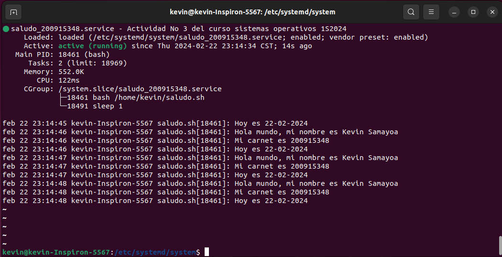

|              |                |
|    :---      |      ---:      |
| Nombre: Kevin Martin Samayoa Urizar | Curso: Sistemas Operativos 1 |
| Carnet: 200915348                   | Fecha: 24/02/2024            |

# ACTIVIDAD 3

## Contenido
- [Servicio del sistema Linux](#servicio)
- [Capturas](#capturas)

---

<a name="servicio"></a>
## Systemd Unit 

1. Se crea un archivo de servicio de systemd con extensión `.service` en la carpeta `/etc/systemd/system/`. Este archivo puede ser nombrado con cualquier nombre, pero es recomendable utilizar un nombre descriptivo para que sea fácil identificar el servicio. Para este caso lo llamaremos `saludo_200915348.service`.

2. Con un editor de texto cualquiera, para este caso ***nano*** se abre el archivo `saludo_200915348.service` y se define las opciones necesarias. A continuación se nuestra algunas opciones que se pueden definir:

* Descripción: una descripción breve del servicio.
* Ejecutable: la ruta al ejecutable que debe ser iniciado como servicio.
* Dependencias: otros servicios que deben ser iniciados antes de este servicio.
* Usuario: el usuario bajo el cual se debe ejecutar el servicio.
* Grupo: el grupo bajo el cual se debe ejecutar el servicio.
* Directorio de trabajo: el directorio de trabajo del servicio.

Este sera el contenido del archivo `saludo_200915348.service`

```
[Unit]
Description=Actividad No 3 del curso sistemas operativos 1S2024

[Service]
ExecStart=/home/kevin/saludo.sh            
Restart=always
IgnoreSIGPIPE=no

[Install]
Alias=saludo.service
```
3. Una vez definido las opciones, se guarda el archivo de servicio.

4. Se recarga la configuración de systemd para que reconozca el nuevo archivo de servicio. Para hacerlo se ejecuta el siguiente comando en la terminal:

        sudo systemctl daemon-reload

5. Para iniciar el servicio, se ejecuta el siguiente comando en la terminal:

        sudo systemctl start saludo_200915348.service

6. Para verificar el estado del servicio para asegurarse de que se esté ejecutando correctamente, se ejecuta el siguiente comando en la terminal:

        sudo systemctl status saludo_200915348.service

Esto mostrará información sobre el estado actual del servicio, incluyendo si está activo o inactivo, si ha ocurrido algún error, etc.

Si se desea que el servicio se inicie automáticamente cada vez que se inicie el sistema, se puede habilitarlo ejecutando el siguiente comando en la terminal:

```
sudo systemctl enable saludo_200915348.service
```

Esto creará un enlace simbólico desde la carpeta `/etc/systemd/system/multi-user.target.wants/` a la ubicación del archivo de servicio.

---

<a name="capturas"></a>
## Capturas

Se muestra una captura del servicio `saludo_200915348.service` habilitando e iniciando:


Captura del estado del servicio `saludo_200915348.service`:


