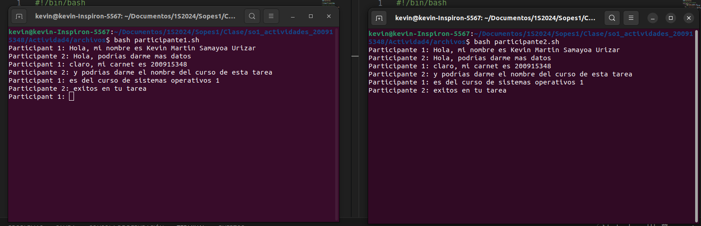

|              |                |
|    :---      |      ---:      |
| Nombre: Kevin Martin Samayoa Urizar | Curso: Sistemas Operativos 1 |
| Carnet: 200915348                   | Fecha: 03/03/2024            |

# ACTIVIDAD 4

## Contenido
- [Chat Basico con Named Pipes](#funcionamiento)
- [Capturas](#capturas)

---

<a name="funcionamiento"></a>
## Funcionamiento 

1. se crea un script por participante
2. En cada script se realiza
    - Se crea un nombre de pipe de la forma `PIPE=/tmp/chat_pipe`
    - Se crea el pipe si no existe `[ -p $PIPE ] || mkfifo $PIPE`
    - Se crea un bucle para enviar mensajes en cada participante 

    ```
    participante 1
    while true; do
        read -p "Participante 1: " message
        echo "$message" > $PIPE
        if read message <$PIPE; then
            echo "$message"
        fi
    done
    ```

    ```
    participante 2
        while true; do
            if read message <$PIPE; then
                echo "Participante 1: $message"
            fi
            read -p "Participante 2: " message
            echo "Participante 2: $message" > $PIPE
        done
    ```
3. Por ultimo, se ejecuta cada script en una terminal distinta 

---

<a name="capturas"></a>
## Capturas

Se muestra una captura del chat en funcionamiento



