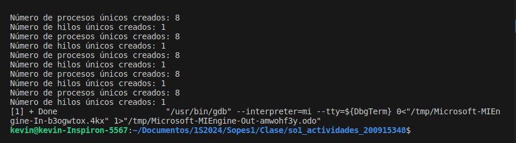

|              |                |
|    :---      |      ---:      |
| Nombre: Kevin Martin Samayoa Urizar | Curso: Sistemas Operativos 1 |
| Carnet: 200915348                   | Fecha: 10/03/2024            |

# ACTIVIDAD 5

## Contenido
- [Codigo original](#original)
- [Codigo corregido](#correccion)
- [Explicación](#explicacion)
- [Salida](#resultados)
- [Capturas](#capturas)

---

<a name="original"></a>
## Codigo original

```
    pid_t pid;

    pid = fork()
    if (pid == 0) { /*child process */
        fork();
        thread_create( ...);
    }
    fork();
```

<a name="correccion"></a>
## Codigo corregido

 ```
    pid_t pid;

    pid = fork()
    if (pid == 0) { /*child process */
        fork();
        pthread_t newThread;
        pthread_create(&newThread, NULL, NULL, NULL);
    }
    fork();
```

<a name="explicacion"></a>
## Explicación

* Para lograr que el codigo funcione, se crea una variable de tipo `pthread_t`, en este caso la llamamos `newThread` quedando de la siguiente forma `pthread_t newThread;`.

    Luego este hilo se pasa como parametro en la funcion `pthread_create`, la cual recibe otros 4 parametros, el tercer parametro, sería una funcion que contenga la implementacion del hilo, pero en este caso solo queremos crear el hilo por lo que queda de la siguiente forma: `pthread_create(&newThread, NULL, NULL, NULL);`

* Para calcular el número de procesos únicos, se utiliza la formula `2^N`, donde `N` es el número de veces que se llama el metodo `fork()` que como se puede ver en el código se llama 3 veces. Por lo tanto con `N=3`, como es en este caso, obtendremos `2^3 = 8` procesos unicos.

* Para el número de hilos únicos, solo se cuenta el número de llamadas a `pthread_create()`, y como se puede ver en el código, solo se llama una vez.

<a name="resultados"></a>
## Resultados

a) ¿Cuántos procesos únicos son creados? R// 8

b) ¿Cuántos hilos únicos son creados? R// 1

<a name="capturas"></a>
## Capturas

Se muestra una captura de la salida del código
